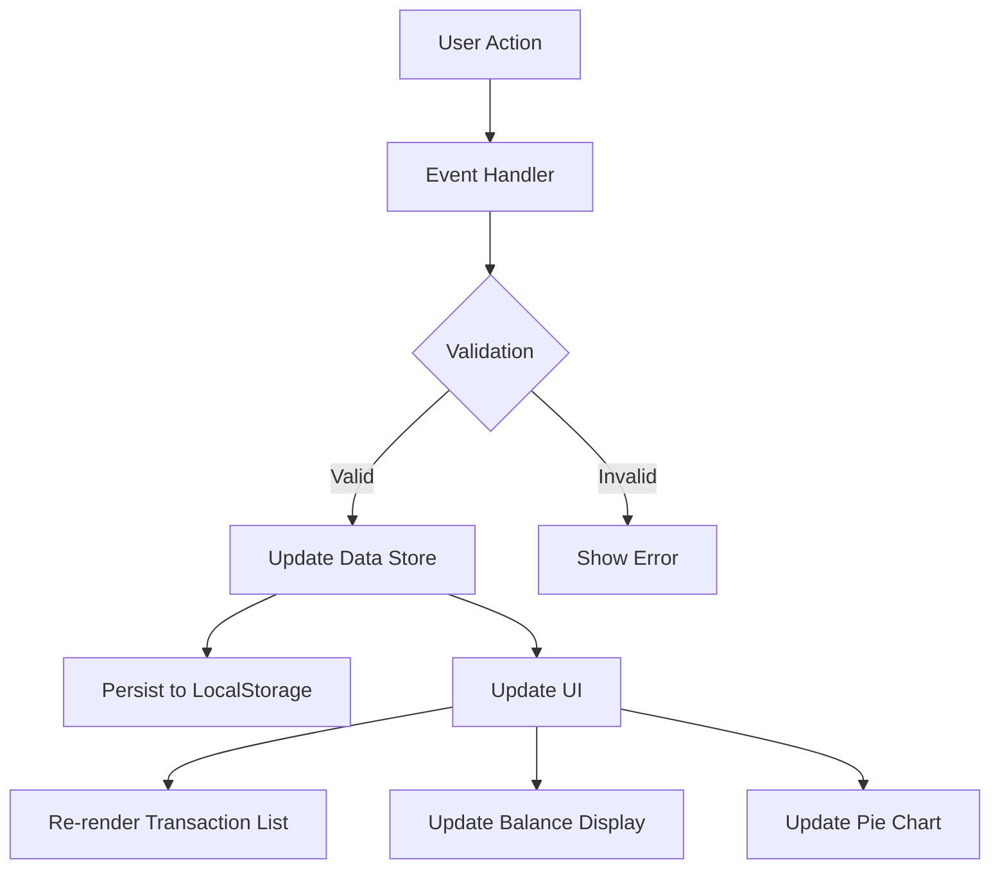

# Design Document

## Overview

The Expense & Budget Visualizer is a single-page web application built with pure HTML, CSS, and Vanilla JavaScript. It allows users to record personal expenses, view a running balance, see spending by category in a list, and visualize category distribution through a pie chart. All data is stored in the browser's LocalStorage API, making the application entirely client-side with no backend dependency.

The application is structured around three core UI components: the Input Form (for adding transactions), the Transaction List (for viewing and deleting entries), and the Pie Chart (for visualizing category distribution). A Balance Display component sits at the top of the page, showing the cumulative total of all expenses. The application uses Chart.js (loaded via CDN) to render the pie chart.

Key design goals:
- **Simplicity**: Single HTML file at root, one CSS file, one JavaScript file
- **Persistence**: All data stored in LocalStorage under a single fixed key
- **Responsiveness**: Functional from 320px to 1920px viewport width
- **Performance**: All UI updates complete within 100ms of user actions
- **Browser Compatibility**: Works in Chrome, Firefox, Edge, Safari (latest stable desktop versions)

---

## Architecture

The application follows a simple Model-View-Controller (MVC)-inspired pattern without a formal framework:

1. **Model Layer** (Data Store)
   - In-memory array of transaction objects
   - Single source of truth for all expense data
   - Synchronized with LocalStorage on every mutation (add, delete)

2. **Controller Layer** (Application Logic)
   - Input validation
   - Balance calculation
   - Category aggregation for pie chart
   - LocalStorage serialization/deserialization
   - Event handlers for user interactions

3. **View Layer** (DOM Manipulation)
   - Rendering transaction list from data store
   - Updating balance display
   - Updating pie chart via Chart.js API
   - Error message display



**File Structure:**
```
/
├── index.html           (main HTML file, includes Chart.js CDN link)
├── css/
│   └── styles.css       (all styling)
└── js/
    └── app.js           (all application logic)
```

---

## HTML Structure (`index.html`)

This section contains the complete, production-ready HTML for the application. All IDs and classes are referenced directly by `js/app.js` for DOM manipulation.

```html
<!DOCTYPE html>
<html lang="en">
  <head>
    <meta charset="UTF-8" />
    <meta name="viewport" content="width=device-width, initial-scale=1.0" />
    <meta name="description" content="Track personal expenses, view a running balance, and visualize spending by category." />
    <title>Expense &amp; Budget Visualizer</title>

    <!-- Chart.js CDN -->
    <script
      src="https://cdn.jsdelivr.net/npm/chart.js@4.4.0/dist/chart.umd.min.js"
      defer
    ></script>

    <!-- Application stylesheet -->
    <link rel="stylesheet" href="css/styles.css" />
  </head>

  <body>
    <!-- Browser-compatibility overlay (shown via JS when browser is unsupported) -->
    <div id="browser-warning" class="browser-warning" role="alert" aria-live="assertive" hidden>
      <p>
        This app requires a modern browser. Please use
        <a href="https://www.google.com/chrome/" target="_blank" rel="noopener">Chrome</a>,
        <a href="https://www.mozilla.org/firefox/" target="_blank" rel="noopener">Firefox</a>,
        <a href="https://www.microsoft.com/edge" target="_blank" rel="noopener">Edge</a>, or
        <a href="https://www.apple.com/safari/" target="_blank" rel="noopener">Safari</a>.
      </p>
    </div>

    <!-- Global notification banner (errors / warnings shown via JS) -->
    <div id="notification-banner" class="notification-banner" role="alert" aria-live="polite" hidden></div>

    <!-- Loading indicator (shown via JS when load time exceeds 500 ms) -->
    <div id="loading-indicator" class="loading-indicator" role="status" aria-live="polite" hidden>
      <span class="loading-spinner" aria-hidden="true"></span>
      <span>Loading&hellip;</span>
    </div>

    <!-- ========================================================
         Main application wrapper
         ======================================================== -->
    <main id="app" class="app-container">

      <!-- ── 1. BALANCE DISPLAY ────────────────────────────── -->
      <section
        id="balance-section"
        class="balance-section"
        aria-labelledby="balance-heading"
      >
        <h1 id="balance-heading" class="balance-heading">Total Expenses</h1>
        <p id="balance-display" class="balance-amount" aria-live="polite" aria-atomic="true">
          $0.00
        </p>
      </section>

      <!-- ── 2. INPUT FORM ─────────────────────────────────── -->
      <section
        id="form-section"
        class="form-section"
        aria-labelledby="form-heading"
      >
        <h2 id="form-heading" class="form-heading">Add Expense</h2>

        <form id="transaction-form" class="transaction-form" novalidate>

          <!-- Item Name field -->
          <div class="form-group">
            <label for="item-name" class="form-label">Item Name</label>
            <input
              type="text"
              id="item-name"
              name="itemName"
              class="form-input"
              placeholder="e.g. Groceries at Whole Foods"
              maxlength="100"
              required
              aria-required="true"
              aria-describedby="item-name-error"
            />
            <span
              id="item-name-error"
              class="field-error"
              role="alert"
              aria-live="polite"
              hidden
            ></span>
          </div>

          <!-- Amount field -->
          <div class="form-group">
            <label for="amount" class="form-label">Amount ($)</label>
            <input
              type="number"
              id="amount"
              name="amount"
              class="form-input"
              placeholder="0.01"
              min="0.01"
              max="999999999.99"
              step="0.01"
              required
              aria-required="true"
              aria-describedby="amount-error"
            />
            <span
              id="amount-error"
              class="field-error"
              role="alert"
              aria-live="polite"
              hidden
            ></span>
          </div>

          <!-- Category dropdown -->
          <div class="form-group">
            <label for="category" class="form-label">Category</label>
            <select
              id="category"
              name="category"
              class="form-select"
              required
              aria-required="true"
              aria-describedby="category-error"
            >
              <option value="" disabled selected>Select a category</option>
              <option value="Food">Food</option>
              <option value="Transport">Transport</option>
              <option value="Fun">Fun</option>
            </select>
            <span
              id="category-error"
              class="field-error"
              role="alert"
              aria-live="polite"
              hidden
            ></span>
          </div>

          <!-- Submit button -->
          <button
            type="submit"
            id="submit-btn"
            class="btn btn-primary"
            aria-label="Add expense to list"
          >
            Add Expense
          </button>

        </form>
      </section>

      <!-- ── 3. TRANSACTION LIST ───────────────────────────── -->
      <section
        id="transaction-section"
        class="transaction-section"
        aria-labelledby="transaction-heading"
      >
        <h2 id="transaction-heading" class="transaction-heading">Transaction History</h2>

        <!-- Scrollable list container (populated dynamically by JS) -->
        <ul
          id="transaction-list"
          class="transaction-list"
          aria-label="List of recorded transactions"
          aria-live="polite"
          aria-relevant="additions removals"
        >
          <!-- Empty-state placeholder (visible when list is empty) -->
          <li id="empty-state" class="empty-state" aria-label="No transactions recorded">
            No transactions yet. Add an expense above to get started.
          </li>
        </ul>

        <!-- Truncation indicator (shown by JS when transaction count reaches 500) -->
        <p id="truncation-indicator" class="truncation-indicator" role="status" hidden>
          Maximum of 500 transactions reached. Delete existing entries to add more.
        </p>

      </section>

      <!-- ── 4. PIE CHART ──────────────────────────────────── -->
      <section
        id="chart-section"
        class="chart-section"
        aria-labelledby="chart-heading"
      >
        <h2 id="chart-heading" class="chart-heading">Spending by Category</h2>

        <!-- Chart.js renders here -->
        <div class="chart-wrapper">
          <canvas
            id="pie-chart"
            class="pie-chart"
            aria-label="Pie chart showing spending distribution by category"
            role="img"
          ></canvas>
        </div>

        <!-- Empty-state message (shown by JS when no data exists) -->
        <p id="chart-empty-state" class="chart-empty-state" role="status" hidden>
          No transactions to display. Add an expense to see your spending breakdown.
        </p>

        <!-- Chart unavailable fallback (shown by JS when Chart.js fails to load) -->
        <p id="chart-unavailable" class="chart-unavailable" role="alert" hidden>
          Chart visualization unavailable. Check your internet connection.
        </p>

      </section>

    </main>

    <!-- Application logic -->
    <script src="js/app.js"></script>
  </body>
</html>
```

**Key structural decisions:**

- The `<script src="js/app.js">` tag is placed at the end of `<body>` so the DOM is fully parsed before the script runs, eliminating the need for a `DOMContentLoaded` listener (though `handlePageLoad` can still be wired to that event as a defensive pattern).
- Chart.js is loaded with `defer` so it does not block initial HTML parsing.
- Every interactive or dynamically updated element has a unique `id` used by `app.js` for DOM selection; CSS targeting uses `class` attributes only, keeping JS and CSS concerns separated.
- `aria-live` regions (`polite` for non-urgent updates, `assertive` for the browser-compatibility overlay) ensure screen readers announce dynamic changes.
- All form inputs include native HTML5 validation attributes (`required`, `min`, `max`, `maxlength`, `step`) as a first layer of defence; the `Validator` module provides the authoritative second layer.
- The `novalidate` attribute on `<form>` suppresses the browser's built-in validation UI so the app can display its own styled inline error messages (Requirement 1.4).

---

## Components and Interfaces

### 1. Data Store Module

**Responsibility:** Maintain in-memory state and synchronize with LocalStorage.

**State:**
```javascript
// In-memory array of transaction objects
let transactions = [];

// LocalStorage key constant
const STORAGE_KEY = 'expense_budget_visualizer_transactions';
```

**Core Functions:**

- `loadTransactions()`
  - **Input:** None
  - **Output:** Array of transaction objects
  - **Behavior:** Reads from LocalStorage, deserializes JSON, validates structure. Returns empty array if key not found or if JSON parsing fails. Logs warning on parse error.

- `saveTransactions(transactionsArray)`
  - **Input:** Array of transaction objects
  - **Output:** Boolean (success/failure)
  - **Behavior:** Serializes array to JSON, writes to LocalStorage under `STORAGE_KEY`. Returns false if LocalStorage is unavailable (quota exceeded or disabled).

- `addTransaction(transaction)`
  - **Input:** Transaction object `{ itemName: string, amount: number, category: string, timestamp: number }`
  - **Output:** Boolean (success/failure)
  - **Behavior:** Validates input, checks transaction limit (500), appends to `transactions`, calls `saveTransactions()`, returns success status.

- `deleteTransaction(timestamp)`
  - **Input:** Unique timestamp (number)
  - **Output:** Boolean (success/failure)
  - **Behavior:** Finds transaction by timestamp, removes from `transactions` array, calls `saveTransactions()`, returns success status.

### 2. Validator Module

**Responsibility:** Validate user input before submission.

**Core Function:**

- `validateTransaction(itemName, amount, category)`
  - **Input:** 
    - `itemName` (string): user-entered item name
    - `amount` (string or number): user-entered amount
    - `category` (string): selected category
  - **Output:** Object `{ valid: boolean, errors: { itemName?: string, amount?: string, category?: string } }`
  - **Validation Rules:**
    - `itemName`: not empty after trimming, max 100 characters
    - `amount`: numeric value between 0.01 and 999,999,999.99 inclusive
    - `category`: one of "Food", "Transport", "Fun"
  - **Returns:** validation result with field-specific error messages

### 3. Balance Calculator Module

**Responsibility:** Compute total balance from transaction list.

**Core Function:**

- `calculateTotalBalance(transactionsArray)`
  - **Input:** Array of transaction objects
  - **Output:** Number (total balance)
  - **Behavior:** Sums all transaction amounts, returns 0 if array is empty. Only includes transactions with positive amounts.

### 4. Category Aggregator Module

**Responsibility:** Compute per-category totals for pie chart.

**Core Function:**

- `aggregateByCategory(transactionsArray)`
  - **Input:** Array of transaction objects
  - **Output:** Object `{ Food: number, Transport: number, Fun: number }`
  - **Behavior:** Groups transactions by category, sums amounts per category, excludes zero/negative amounts, returns object with category totals (defaults to 0 for categories with no transactions).

### 5. UI Renderer Module

**Responsibility:** Update DOM to reflect current data store state.

**Core Functions:**

- `renderTransactionList(transactionsArray)`
  - **Input:** Array of transaction objects
  - **Output:** None (side effect: updates DOM)
  - **Behavior:** Clears existing list, iterates transactions in reverse order (most recent first), creates DOM elements for each transaction (item name, amount with currency symbol, category, delete button), appends to transaction list container. Shows placeholder message if array is empty. Shows truncation indicator if count >= 500.

- `renderBalanceDisplay(balance)`
  - **Input:** Number (total balance)
  - **Output:** None (side effect: updates DOM)
  - **Behavior:** Formats balance with currency symbol ($), thousands separator, and exactly 2 decimal places. Updates balance display DOM element.

- `renderPieChart(categoryData)`
  - **Input:** Object `{ Food: number, Transport: number, Fun: number }`
  - **Output:** None (side effect: updates Chart.js instance)
  - **Behavior:** If all categories are zero, displays empty state message. Otherwise, constructs Chart.js config with category labels and amounts, creates or updates pie chart. Uses distinct colors for each category (Food: blue, Transport: green, Fun: orange).

- `showError(message, fieldName = null)`
  - **Input:** Error message (string), optional field name (string)
  - **Output:** None (side effect: updates DOM)
  - **Behavior:** Displays error message inline (adjacent to field if `fieldName` provided) or as a notification banner (if no field specified). Auto-dismisses after 5 seconds.

- `clearInputForm()`
  - **Input:** None
  - **Output:** None (side effect: updates DOM)
  - **Behavior:** Clears all form fields, resets category dropdown to first option, focuses item name field.

### 6. Event Handler Module

**Responsibility:** Respond to user interactions.

**Core Functions:**

- `handleFormSubmit(event)`
  - **Input:** Form submit event
  - **Output:** None (side effect: updates data store and UI)
  - **Behavior:** Prevents default form submission, reads form values, calls `validateTransaction()`, displays errors or calls `addTransaction()`, updates UI on success.

- `handleDeleteClick(timestamp)`
  - **Input:** Unique timestamp (number)
  - **Output:** None (side effect: updates data store and UI)
  - **Behavior:** Shows confirmation dialog, calls `deleteTransaction()` if confirmed, updates UI (transaction list, balance, pie chart) within 300ms.

- `handlePageLoad()`
  - **Input:** None
  - **Output:** None (side effect: initializes app)
  - **Behavior:** Calls `loadTransactions()`, initializes Chart.js instance, renders initial UI (transaction list, balance, pie chart), attaches event listeners.

---

## Data Models

### Transaction Object

Represents a single expense entry.

**Schema:**
```javascript
{
  itemName: string,      // 1-100 characters, user-entered description
  amount: number,        // 0.01 to 999,999,999.99, positive number
  category: string,      // one of "Food", "Transport", "Fun"
  timestamp: number      // unique identifier, milliseconds since Unix epoch
}
```

**Example:**
```javascript
{
  itemName: "Groceries at Whole Foods",
  amount: 142.75,
  category: "Food",
  timestamp: 1736384400000
}
```

**Validation Constraints:**
- `itemName`: non-empty after trimming, max 100 characters
- `amount`: numeric, range [0.01, 999,999,999.99]
- `category`: enum ["Food", "Transport", "Fun"]
- `timestamp`: auto-generated, unique, used as primary key for deletion

### LocalStorage Structure

All transactions are stored as a single JSON array under one key.

**Key:** `expense_budget_visualizer_transactions`

**Value:** JSON-serialized array of Transaction objects

**Example:**
```json
[
  {
    "itemName": "Groceries at Whole Foods",
    "amount": 142.75,
    "category": "Food",
    "timestamp": 1736384400000
  },
  {
    "itemName": "Uber to airport",
    "amount": 28.50,
    "category": "Transport",
    "timestamp": 1736384410000
  }
]
```

**Error Handling:**
- If key does not exist: initialize with empty array `[]`
- If value is not valid JSON: discard, initialize with empty array, show warning
- If value is valid JSON but not an array: discard, initialize with empty array, show warning
- If LocalStorage is unavailable: display error banner, disable add/delete functionality

### Chart.js Configuration Object

Used to initialize and update the pie chart.

**Schema:**
```javascript
{
  type: 'pie',
  data: {
    labels: ['Food', 'Transport', 'Fun'],
    datasets: [{
      data: [number, number, number],  // category totals
      backgroundColor: ['#4A90E2', '#50E3C2', '#F5A623']  // distinct colors
    }]
  },
  options: {
    responsive: true,
    maintainAspectRatio: false,
    plugins: {
      legend: {
        position: 'bottom'
      }
    }
  }
}
```

**Empty State:**
When all categories have zero amounts, hide chart canvas and display text message: "No transactions to display. Add an expense to see your spending breakdown."

---

## Correctness Properties

*A property is a characteristic or behavior that should hold true across all valid executions of a system — essentially, a formal statement about what the system should do. Properties serve as the bridge between human-readable specifications and machine-verifiable correctness guarantees.*

### Property 1: Validation Correctness

*For any* combination of itemName (string), amount (string or number), and category (string), the validator should return `valid: true` if and only if itemName is non-empty after trimming and at most 100 characters, amount is a number in the range [0.01, 999,999,999.99], and category is one of "Food", "Transport", or "Fun". Equivalently, if any field fails those constraints, the validator should return `valid: false` and an error entry for every failing field, and the transaction count should remain unchanged after a submission attempt.

**Validates: Requirements 1.3, 1.4**

---

### Property 2: Valid Transaction Addition

*For any* valid transaction (itemName, amount, category) that passes validation, adding it to the transaction list should result in the list length increasing by exactly one and the new transaction being present in the list.

**Validates: Requirements 1.5**

---

### Property 3: Transaction List Rendering Completeness

*For any* array of transactions, the rendered Transaction_List should contain exactly one row per transaction, with each row showing the item name (truncated to 100 characters if longer), the amount formatted with a currency symbol and exactly two decimal places, the category, and a visible delete control.

**Validates: Requirements 3.1, 4.1**

---

### Property 4: Most-Recent-First Ordering

*For any* array of transactions with distinct timestamps, the rendered Transaction_List should display them in descending timestamp order (most recently added first).

**Validates: Requirements 3.5**

---

### Property 5: Serialization Round-Trip

*For any* array of transaction objects, serializing the array to JSON and then deserializing it should produce an array that is deeply equal to the original (same items, same field values, same order).

**Validates: Requirements 2.1, 2.2**

---

### Property 6: Deletion Consistency

*For any* non-empty transaction array and any transaction within it, confirming deletion of that transaction should: (a) remove it from the in-memory list, (b) update LocalStorage to no longer contain that transaction, and (c) leave all other transactions intact and unchanged.

**Validates: Requirements 2.3, 4.3**

---

### Property 7: Cancel Preserves State

*For any* transaction list and any attempted deletion that the user cancels, the in-memory transaction list and LocalStorage contents should remain identical to their state before the delete was initiated.

**Validates: Requirements 4.4**

---

### Property 8: Balance Calculation Accuracy

*For any* array of transactions, the value displayed in the Balance_Display should equal the sum of all transaction amounts, formatted with a currency symbol, thousands separator, and exactly two decimal places. This property holds after any add or delete operation, and holds for the empty array (displaying "$0.00").

**Validates: Requirements 5.2, 5.3, 5.4, 5.5, 5.6, 4.5**

---

### Property 9: Category Aggregation Accuracy

*For any* array of transactions (including after add or delete operations), the data fed into the Pie_Chart should equal the sum of amounts per category, excluding any transaction with an amount ≤ 0, and should reflect the current state of the transaction list.

**Validates: Requirements 6.1, 6.2, 6.3, 4.6**

---

### Property 10: Chart Segment Labels and Distinct Colors

*For any* category data object where at least one category has a positive total, the Chart.js configuration produced by the renderer should assign each represented category a label equal to its category name and a background color distinct from all other categories' background colors.

**Validates: Requirements 6.4**

---

### Property 11: Zero and Negative Amount Exclusion

*For any* array of transactions that includes items with amount ≤ 0, the category aggregation function should produce totals as if those transactions did not exist (i.e., the same result as the array with those items removed).

**Validates: Requirements 6.6**

---

## Error Handling

### LocalStorage Errors

**Scenario:** LocalStorage quota exceeded or disabled by user.

**Detection:** Try-catch around `localStorage.setItem()` calls.

**Response:**
- Display error notification: "Unable to save data. Your browser storage may be full or disabled."
- Keep transaction in memory but do not persist
- Disable add/delete buttons until issue resolved
- Log error to console for debugging

### JSON Parse Errors

**Scenario:** LocalStorage contains malformed data (corrupted or manually edited).

**Detection:** Try-catch around `JSON.parse()` in `loadTransactions()`.

**Response:**
- Discard malformed data
- Initialize with empty array `[]`
- Display warning notification: "Saved data was corrupted and has been reset."
- Log error to console for debugging

### Input Validation Errors

**Scenario:** User submits form with invalid or missing fields.

**Detection:** `validateTransaction()` returns `valid: false`.

**Response:**
- Display inline error messages adjacent to failing fields:
  - Item Name: "Item name is required and must be 100 characters or less."
  - Amount: "Amount must be between $0.01 and $999,999,999.99."
  - Category: "Please select a category."
- Preserve all field values (do not clear form)
- Focus first invalid field
- Do not submit transaction

### Chart.js Load Failure

**Scenario:** Chart.js CDN is unreachable or fails to load.

**Detection:** Check if `Chart` global is defined after script load.

**Response:**
- Display message in chart container: "Chart visualization unavailable. Check your internet connection."
- App remains functional (add, delete, balance still work)
- Log error to console

### Browser Compatibility Errors

**Scenario:** User loads app in unsupported browser (e.g., Internet Explorer).

**Detection:** Feature detection for LocalStorage and ES6 features.

**Response:**
- Display full-screen overlay message: "This app requires a modern browser. Please use Chrome, Firefox, Edge, or Safari."
- Hide all app content
- Provide links to supported browsers

---

## Testing Strategy

### Unit Tests

Use Jest or Mocha for unit testing individual functions:

1. **Validator Module**
   - Test valid inputs pass validation
   - Test empty item name fails
   - Test item name over 100 characters fails
   - Test amount below 0.01 fails
   - Test amount above 999,999,999.99 fails
   - Test non-numeric amount fails
   - Test invalid category fails

2. **Balance Calculator**
   - Test empty array returns 0
   - Test single transaction returns correct amount
   - Test multiple transactions sum correctly
   - Test negative amounts are excluded

3. **Category Aggregator**
   - Test empty array returns all categories with 0
   - Test single category transaction
   - Test multiple transactions across all categories
   - Test zero/negative amounts are excluded

4. **LocalStorage Module**
   - Test `loadTransactions()` with empty storage
   - Test `loadTransactions()` with valid JSON
   - Test `loadTransactions()` with malformed JSON (error handling)
   - Test `saveTransactions()` success
   - Test `saveTransactions()` quota exceeded (error handling)

### Property-Based Tests

Property-based tests validate universal properties across randomly generated inputs. Use [fast-check](https://fast-check.dev/) (available on NPM) as the property-based testing library. Configure each test to run a **minimum of 100 iterations**.

Each property-based test must reference its design document property using the tag comment:
```javascript
// Feature: expense-budget-visualizer, Property {number}: {property_text}
```

**Tests to implement (one test per property):**

- **Property 1 — Validation Correctness**: Generate random (itemName, amount, category) inputs, including boundary values and invalid combos. Verify that `validateTransaction()` returns `valid: true` if and only if all fields satisfy their constraints.

- **Property 2 — Valid Transaction Addition**: Generate random valid transactions (passing validation). Add each to the list and verify count increases by 1 and transaction is retrievable.

- **Property 3 — Transaction List Rendering Completeness**: Generate random transaction arrays. Render the list and verify each row contains name (100-char truncation applied), formatted amount, category, and delete control.

- **Property 4 — Most-Recent-First Ordering**: Generate random transaction arrays with distinct timestamps. Render list and verify descending timestamp order.

- **Property 5 — Serialization Round-Trip**: Generate random transaction arrays. Serialize to JSON then deserialize. Verify deep equality with original.

- **Property 6 — Deletion Consistency**: Generate random non-empty transaction arrays. Pick a random transaction to delete, confirm deletion, verify it is removed from memory and LocalStorage, and all others remain.

- **Property 7 — Cancel Preserves State**: Generate random transaction arrays. Initiate delete then cancel. Verify list and storage unchanged.

- **Property 8 — Balance Calculation Accuracy**: Generate random transaction arrays (including empty). Verify `calculateTotalBalance()` output equals sum of amounts and that the formatted string matches the expected currency format.

- **Property 9 — Category Aggregation Accuracy**: Generate random transaction arrays (including some with zero/negative amounts). Verify `aggregateByCategory()` output matches per-category sum excluding non-positive amounts.

- **Property 10 — Chart Segment Labels and Distinct Colors**: Generate random category data objects with at least one positive category total. Verify chart config assigns correct labels and all `backgroundColor` entries are distinct.

- **Property 11 — Zero and Negative Amount Exclusion**: Generate transaction arrays containing at least one item with amount ≤ 0. Verify aggregation result equals aggregation of the filtered-positive-only subarray.

### Integration Tests

Use Playwright or Cypress for end-to-end testing:

1. **Add Transaction Flow**
   - Fill form, submit, verify transaction appears in list
   - Verify balance updates
   - Verify pie chart updates

2. **Delete Transaction Flow**
   - Add transaction, click delete, confirm, verify removal
   - Verify balance updates
   - Verify pie chart updates

3. **Persistence Flow**
   - Add transactions, reload page, verify data persists
   - Clear LocalStorage, reload page, verify empty state

4. **Error Scenarios**
   - Submit empty form, verify errors display
   - Mock LocalStorage quota exceeded, verify error notification
   - Mock Chart.js load failure, verify fallback message

### Browser Compatibility Tests

Manual testing on:
- Chrome (latest stable)
- Firefox (latest stable)
- Edge (latest stable)
- Safari (latest stable)

Test on viewport widths: 320px, 768px, 1024px, 1920px

Verify:
- All features functional
- No horizontal scrolling
- All text readable
- All controls operable
- LocalStorage works correctly

